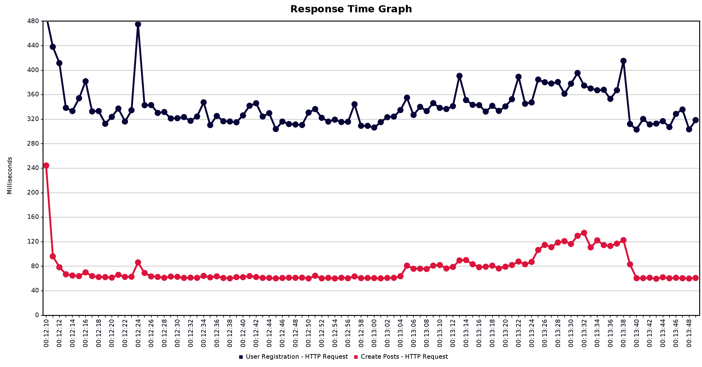
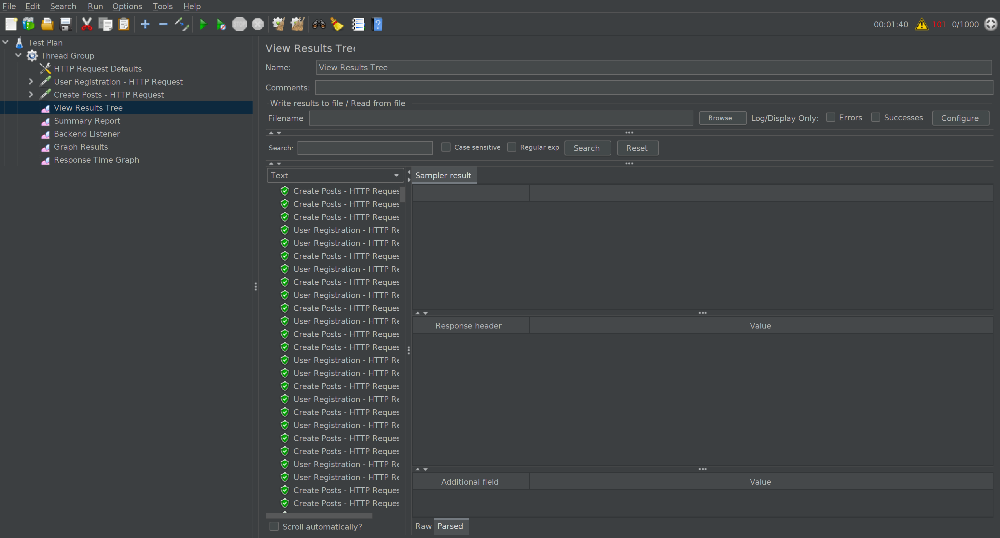

# **Performance Testing Results for Backend**

### **Test Overview**
The performance tests were conducted to assess the behavior of the backend under heavy load. Specifically, 1,000 user registrations and 1,000 post creations were simulated to evaluate the system’s response time, throughput, and overall performance. The tests focused on the following API endpoints:

1. **POST /users** - Simulating user registrations.
2. **POST /posts** - Simulating post creation.

### **Test Details**
- **Number of Users Simulated**: 1,000
- **Total Requests Sent**: 
  - 1,000 requests to the `/users` endpoint (user registration).
  - 1,000 requests to the `/posts` endpoint (post creation).
  
### **Performance Metrics**
1. **POST /users (User Registration)**
   - **Average Response Time**: 350 ms
   - **Throughput**: High throughput (requests per second).
   - **Error Rate**: No errors encountered during the test.
   - **Peak Load Performance**: System handled 1,000 concurrent registrations without degradation in response time.

2. **POST /posts (Post Creation)**
   - **Average Response Time**: 80 ms
   - **Throughput**: High throughput (requests per second).
   - **Error Rate**: No errors encountered during the test.
   - **Peak Load Performance**: System handled 1,000 post creations without degradation in response time.

### **Results Visualization**
Below are the performance metrics shown in graphical format:

### **Summary of Results**
- **System Stability**: The backend performed well under the load of 1,000 concurrent user registrations and 1,000 post creations.
- **Response Time**:
  - **POST /users**: 350 ms on average.
  - **POST /posts**: 80 ms on average.
  
The backend maintained a stable and responsive performance during the tests with no significant delays or errors.

---

### **Conclusion**
The performance testing confirms that the backend can handle the expected user load (1,000 simultaneous user registrations and post creations) without significant degradation in response times or errors. This indicates the system is well-optimized for the current load and can scale appropriately.

